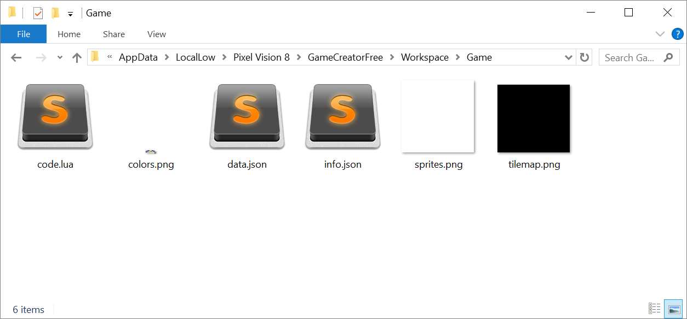
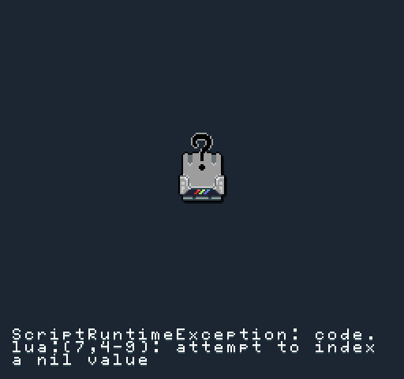

# Editing a Game

When you launch the Game Creator, it attempts to load the files in the Game Directory. Here we have created a new game and can see the default message letting us know the game works and is ready to be modified.

All of the game's files are inside of the Workspace’s Game directory.

Pixel Vision 8 game files can be modified by external editors. This allows you to use Photoshop, Aseprite, or any pixel editor for creating sprites and tilemaps. Likewise, feel free to use any code editor for working with a game's Lua and JSON files. 

At any point, you can switch back into the Game Creator’s edit mode by pressing `Ctrl + 1`. By default, the New Project Tool should automatically load.

If you were using a different tool, that one would reload instead of the default New Game Tool allowing you resume what you were doing before running the game. Once in edit mode, you can always return to play mode by pressing the play button or using the `Ctrl + 1` keyboard shortcut.

If you are playing a game and want to see any changes you have made externally, you can also use `Ctrl + 4` to force the game to reload without entering edit mode. If your game fails to load, the Game Creator shows an error screen to help you debug the issue.

Once you have fixed the error, simply reload the game. All errors and print statements are visible in the Debugger Tool. You can open this tool by switching to edit mode and selecting it from the toolbar.

The Debugger Tool maintains the log file while the Game Creator is running. 

When you exit, the Game Creator deletes the log file and all of the contents of the Tmp directory. You can access the log file directly from Workspace's Tmp folder.

Since it is a text file, you can open it in any external text editor.


