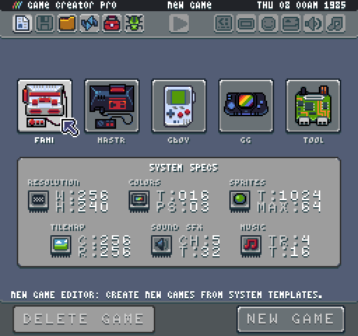

# System Templates

Under the hood, the Pixel Vision 8 engine is broken down into several "chips" that control how the engine behaves. The chip system is modular, allowing you to define each chip’s limitations. When creating a new game, you can customize system limitations by selecting one of the pre-configured system templates:

The specs panel represents a summary of a system template’s limitations. It is broken down into six aspects that map over to Pixel Vision 8’s built-in chips. Here are the main chips groups that make up a working system: resolution, colors, sprites, tilemap, sound SFX, and music. Together these limitations help define what you can and can’t do when making PV8 games and tools.

Here is a breakdown of each property: 

### Resolution

<table>
  <tr>
    <td>W</td>
    <td>Width</td>
    <td>The width of the screen’s resolution.</td>
  </tr>
  <tr>
    <td>H</td>
    <td>Height</td>
    <td>The height of the screen’s resolution.</td>
  </tr>
</table>

### Colors

<table>
  <tr>
    <td>T</td>
    <td>Total</td>
    <td>Total number of colors the system supports.</td>
  </tr>
  <tr>
    <td>PS</td>
    <td>Colors Per Sprite</td>
    <td>Total colors per sprite.</td>
  </tr>
</table>

### Sprites

<table>
  <tr>
    <td>T</td>
    <td>Total Sprites</td>
    <td>The total number of sprites allowed in the memory.</td>
  </tr>
  <tr>
    <td>Max</td>
    <td>Maximum Sprites</td>
    <td>The maximum number of sprites the display can render in a single frame.</td>
  </tr>
</table>

### Tilemap

<table>
  <tr>
    <td>W</td>
    <td>Width</td>
    <td>The width (in tiles) of the tile map.</td>
  </tr>
  <tr>
    <td>H</td>
    <td>Height</td>
    <td>The height (in tiles) of the tile map.</td>
  </tr>
</table>

### Sound

<table>
  <tr>
    <td>CH</td>
    <td>Channels</td>
    <td>The total number of channels on which the system can play sounds.</td>
  </tr>
  <tr>
    <td>T</td>
    <td>Total</td>
    <td>The total number of sound effects the system can store in its memory.</td>
  </tr>
</table>

### Music

<table>
  <tr>
    <td>TR</td>
    <td>Tracks</td>
    <td>The total number of tracks the music chip can use to play back sounds.</td>
  </tr>
  <tr>
    <td>T</td>
    <td>Total</td>
    <td>The total amount of music data the system can store in its memory.</td>
  </tr>
</table>


