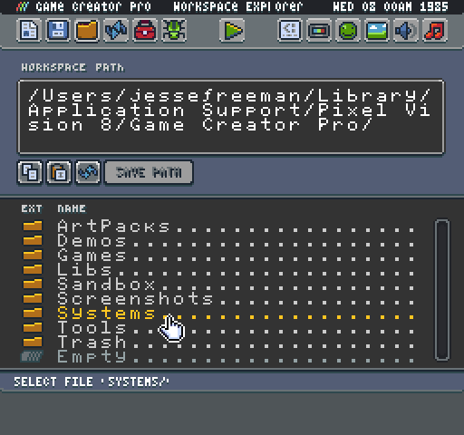
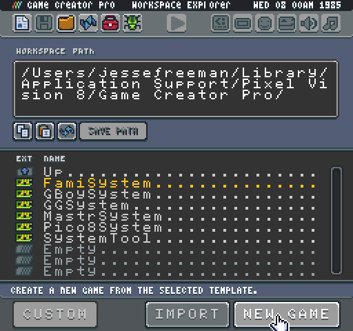
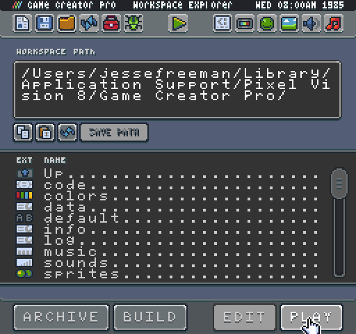
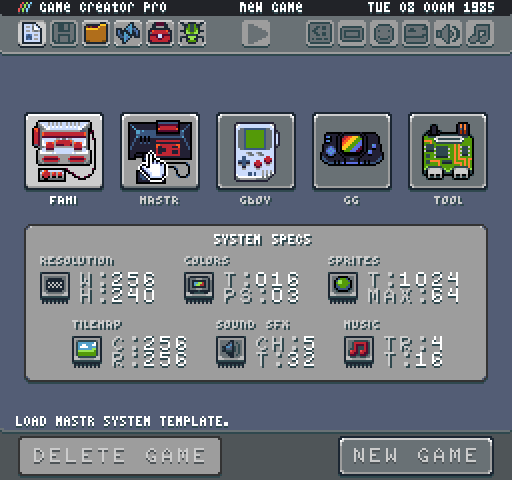
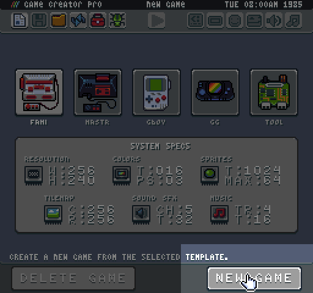
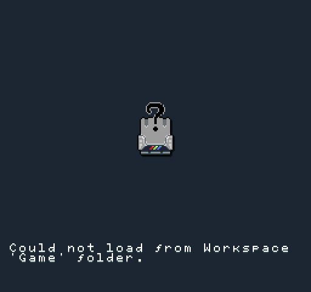

# Creating A New Game

When you load up Game Creator for the first time, you are taken directly to the Workspace Explorer Tool. From here, there are two ways to create a new game. The first is to open up the Workspace/Systems directory.

From here, you can select any built-in system template you’d like to start a new game from by clicking on the template name and hitting New Game.

This will copy the contents of the system template into your Workspace/Sandbox folder and you can begin working on your game.

The second way to create a new game is to use the built in New Game Tool. The New Game Tool is located in the Workspace/Tools directory. This tool allows you to preview the specs of each of the core system templates and delete an existing game in the Sandbox folder to start from scratch.

You can create an empty game project by clicking on the new game button at the bottom of the screen. 

Once pressed, the Game Creator copies the default system template over to the Game folder. When the Game folder is ready, Game Creator automatically switches back over to play mode presenting you with a new game file and some instructions on how to edit it.

At this point, you are ready to start coding your game. If for some reason there was a problem loading a game, the Game Creator shows an error with instructions on what to do to fix the problem. 

You can always switch back to edit mode by pressing `Ctrl + 1`. By default, the New Project Tool should automatically load.

Before you create a new game, you must decide which system template you want to use.


