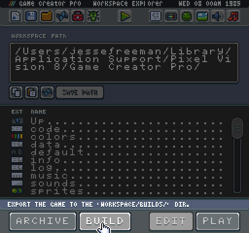
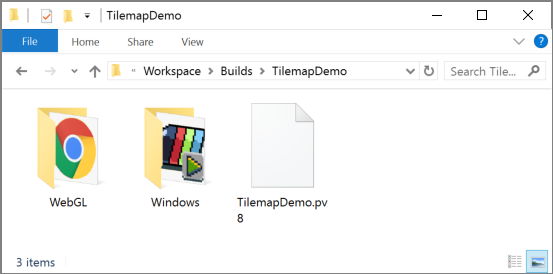
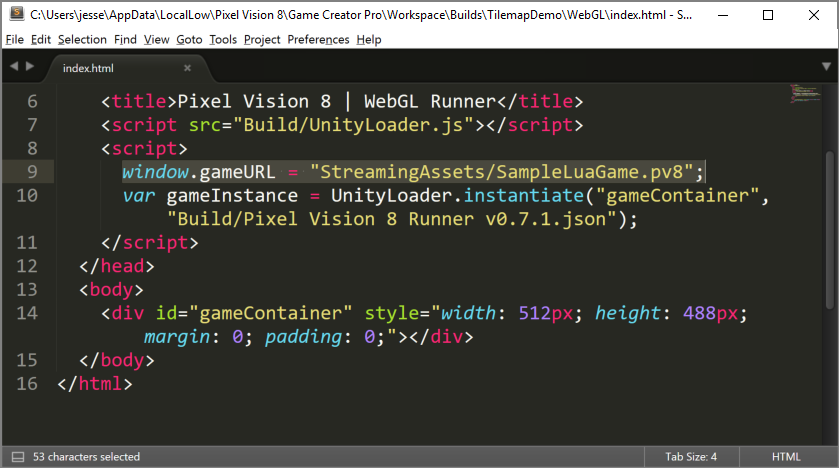

# Exporting Games

While archiving your game is a good way to save it before loading a new project to work on, sometimes you will want to share your creation with others outside of the Game Creator. The Save Tool offers an option to export your game without the need to recompile it. To do this, the Game Creator’s save tool uses Pixel Vision 8 Runner Templates for different platforms and creates a new executable for you. Let’s take a look at how this works.

 

When you are in the Save Tool, you will see export options towards the bottom of the screen.

 

 

The tool currently supports exporting to Windows, Mac, Linux, and WebGL. *Exporting to Unity or MonoGame through the source option is coming soon.* It is important to note that you can only export a project if its type is set to game.

 

 

If you are working on a tool, system template or asset the export controls will be disabled since these types of projects do not work in the runner.

 

 

To change a project and export it, select the correct project type from the tab buttons and hit the save button. This will update the project and enable the export option.

 

Each export option relates to a specific template that is included in the Game Creator. Select the platform you would like the Game Creator to build and click on the export button at the bottom of the screen.

 

 

A new Build folder is created in the Workspace folder and should contain your exported game.

 

 

For the most part, the exported game should just work as is. There are a few exceptions like WebGL. If you open up a WebGL game, you will see an index.html page, a Streaming Assets folder, and a Data folder. Your game will be inside of the Streaming Assets folder. It may be called something like SampleLuaGame.pv8. This will be corrected in future builds of the exporter. You will need to upload everything to this directory to your server. Just be sure to change the URL in the index.html file so that it points to where your game exists online.

 

You will need to update your cross domain policies as well if you plan on hosting your game in a different location than where your index.html file is located. You can see a sample of the Tilemap Demo running in WebGL [here](https://pixelvision8.itch.io/tilemap-demo).

At this time, exporting games is still experimental. There are known issues such as Mac projects not working when created on Windows as well as sound issues and performance in WebGL. Please make sure to send all feedback and bugs to [the forum](https://pixelvision8.itch.io/game-creator/community) so they can be addressed.


